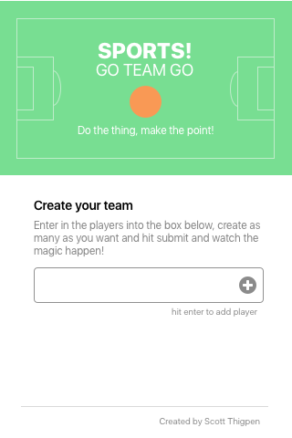
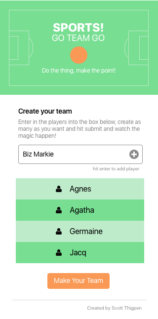
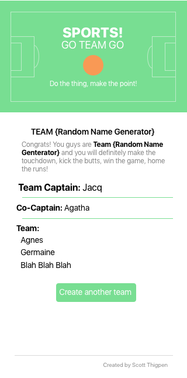

## 🏀 GO TEAM ⚽
Working link (in progress) can be found [here](https://sthig.github.io/goteam2/).

This is a Js/UI/UX project where I'm going to have it to enter in several names and it creates a team with a captain and co-captain (chosen at random).  Also a randomly generated team name will be added as well (for added humor and to keep the user engaged).

### Immediate Todo:

  * Fix flexbox centering in css (✅)
  * Make style sheet in Sketch
  * have make-team button fade in (✅)
  * highlight the `<li>` button in full green (✅)
  * fix spacing (✅)
  * animated gif for the sports ball (✅)
  * space sports title out (✅)
  * update footer (✅)
  * add remove button on name (✅)
  * responsiveness is incorrect on Android phone (✅)
  * buttons on iOS are weird AF, but only on the front page.  The second page they are fine. (✅)
  * fix errors of undefined (✅)
  * prevent user from entering in an empty value on `<li>` (✅)
  * fix errors that say "delete" on the results (✅)
  * remove edit on second page (✅)
  * add edit button on name (✅)
  * draw background for header (the sports field) (✅)
  * entering in blank fields (✅)
  * reverse what you have, enter things into array then into html, not visa versa (😥)
  * make copy paragraph funnier and more concise (enlist Kate on that)
  * If full name, put space in and interject a funny nickname (✅)
  * One name, keep as is (✅)
  * extra click on edit function (✅)
  * fix bug where click was not making the submit button appear (✅)
  * fix responsiveness with too small of icons (use media query) and captain font is off (✅)
  * add cursor pointer over hover of icons (✅)
  * clean up CSS (✅)
  * add hover animation on icon hover (like a tilt or rotate) (❌)
  * static path for bg.svg not working unless I put it in css folder (not right) (✅)
  * Make Capitalization work (✅)
  * ~~somehow get this to share stats on social media~~
  * create validator instead of alert 
  * fix edit focus
  * refactor js
  * Fix "undefined" in the nickname generator (✅)
  * set timeout for fake loading page (for fun) (✅)

# April 8th update
Converted all styles over to Sass using gulp, that worked for the most part but now some things are off even thought I did a mass find-n-replace.  Organized my sass file to do the colors right now too.  Added in loader animation and it has some bugs but not many.  This project is like a hydra, I figure out one thing and 2 problems arise.  I guess that's coding in general.  The spinning square (currently) was found on CodePen, I wrote it line by line to figure out how the author did it (it also seems to be fairly common on CodePen so I don't feel like I stole anything)

# April 5th update
Spent many hours fixing the Gulp/Babel files, I had no idea what that stuff was at first, now I know and now I know to use a boilerplate in the future to skip all that crap.  Jesus, what a nightmare.  After many tears Kyle really helped out a lot.

# April 4th update
Been pretty frustrated at this project as it was supposed to be just a simple rest operator for ES6, I had no idea it'd spin into something like this.  I like it but jesus this is crazy.  I fix one thing and three other things pop up.

# March 31
Made a lot of progress on this and mostly due to memory (also there was one part on the preventDefault that it just magically worked.  I don't know why and still am confused by that).  The project is nearing completion and I honestly can't wait to style it and get v1 out.  

# March 28
Frustrated AF

# March 23 update
I'm rolling down on a few extra things before finessing a few things.  There are a few big ticket issues and smaller ones.

# March 19 Update
I added a few things by myself without really having to look, most notably I was able to do my own setTimeout() function which I was very happy about. I focused a bit on styling things out too this time as well.  I need to make the color better.  Wes Bos's tutorials are indeed, boss and very helpful.

# March 18 Update
I have completed a fair amount of code with the help of Justin, Bryan and Kevin (I used their expertise sparingly).  I was surprised that Stack Overflow was receptive to my questions (as well as super quick) without getting slammed for asking the wrong thing.  You can see my questions asked [here](http://stackoverflow.com/questions/42772179/create-an-array-from-text-input-when-submitted-only-using-vanilla-javascript) and [here](http://stackoverflow.com/questions/42846637/pure-javascript-add-the-value-of-text-input-to-li-when-button-clicked-enter).  Big thanks to [Thomas Konings](https://gist.github.com/tkon99/4c98af713acc73bed74c) on his Random Name Generator which will provide endless entertainment

Using Sketch to comp out my look and layout and will start building out the style sheet.  That can be viewed by clicking [here](https://sketch.cloud/s/qnm2)

## Landing Page

On the landing page the user is presented with instructions to enter in names to create a team.

## Entering in data

Here a user can enter in names, a "make your team" button appears to create the team

## Team created

A randomly generated (and silly) team name will be created, a team captain will be picked at random as well as a co-captain and the team formed using ES6 rest operator in an array.

# Old Notes
## List
* user enters names in the form (comma separated)
* array is formed
* spread operator takes array and randomly assigns a captain and co-captain while the rest are team players
* Captain gets a shiny ⭐ ⭐ for being captain
* Co Captain gets only one ⭐
* team gets listed in a <ul>

## Notes
* having a hard time with the forEach loop when I know is basic stuff, it's just that this is hard for me right now (being completely transparent).
* learning about the rest operator, that's fun, I like that
* added start of my bind child to the list.  This may be a bit of a headache
