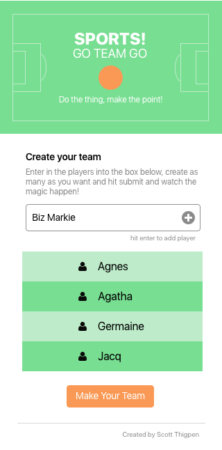

## 🏀 GO TEAM ⚽
Working link (in progress) can be found [here](https://sthig.github.io/goteam2/).

This is a Js/UI/UX project where I'm going to have it to enter in several names and it creates a team with a captain and co-captain (chosen at random).  Also a randomly generated team name will be added as well (for added humor and to keep the user engaged).

### Immediate Todo:
  * Capitalize the first letter of name with this way:
  ```  
  const toSlug = input => encodeURIComponent(
    join('-')(
      map(toLowerCase)(
        split(' ')(
          input
        )
      )
    )
  );

  console.log(toSlug('JS Cheerleader')); // 'js-cheerleader'
   ```
  * Fix flexbox centering in css (✅)
  * Make style sheet in Sketch
  * have make-team button fade in (✅)
  * highlight the `<li>` button in full green (💹)
  * fix spacing
  * animated gif for the sports ball (✅)
  * space sports title out (✅)
  * update footer
  * make copy paragraph funnier and more concise (enlist Kate on that)
  * add edit button on name
  * add remove button on name
  * draw background for header (the sports field)
  * somehow get this to share stats on social media
  * responsiveness is incorrect on Android phone
  * buttons on iOS are weird AF, but only on the front page.  The second page they are fine. (✅)


# March 19 Update
I added a few things by myself without really having to look, most notably I was able to do my own setTimeout() function which I was very happy about. I focused a bit on styling things out too this time as well.  I need to make the color better.  Wes Bos's tutorials are indeed, boss and very helpful.


# March 18 Update
I have completed a fair amount of code with the help of Justin, Bryan and Kevin (I used their expertise sparingly).  I was surprised that Stack Overflow was receptive to my questions (as well as super quick) without getting slammed for asking the wrong thing.  You can see my questions asked [here](http://stackoverflow.com/questions/42772179/create-an-array-from-text-input-when-submitted-only-using-vanilla-javascript) and [here](http://stackoverflow.com/questions/42846637/pure-javascript-add-the-value-of-text-input-to-li-when-button-clicked-enter).  Big thanks to [Thomas Konings](https://gist.github.com/tkon99/4c98af713acc73bed74c) on his Random Name Generator which will provide endless entertainment

Using Sketch to comp out my look and layout and will start building out the style sheet.  That can be viewed by clicking [here](https://sketch.cloud/s/qnm2)

## Landing Page

On the landing page the user is presented with instructions to enter in names to create a team.


## Entering in data

Here a user can enter in names, a "make your team" button appears to create the team



## Team created

A randomly generated (and silly) team name will be created, a team captain will be picked at random as well as a co-captain and the team formed using ES6 rest operator in an array.


# Old Notes
## List
* user enters names in the form (comma separated)
* array is formed
* spread operator takes array and randomly assigns a captain and co-captain while the rest are team players
* Captain gets a shiny ⭐ ⭐ for being captain
* Co Captain gets only one ⭐
* team gets listed in a <ul>

## Notes
* having a hard time with the forEach loop when I know is basic stuff, it's just that this is hard for me right now (being completely transparent).
* learning about the rest operator, that's fun, I like that
* added start of my bind child to the list.  This may be a bit of a headache
